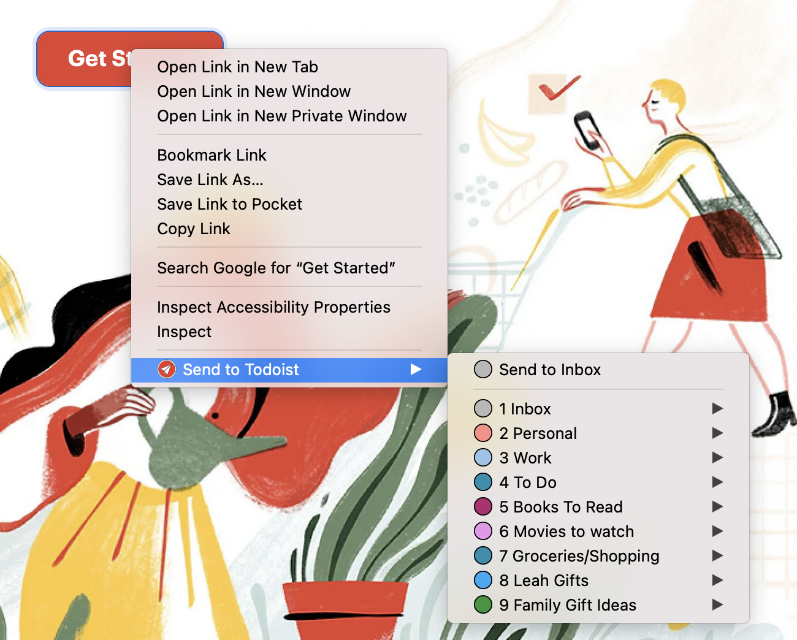
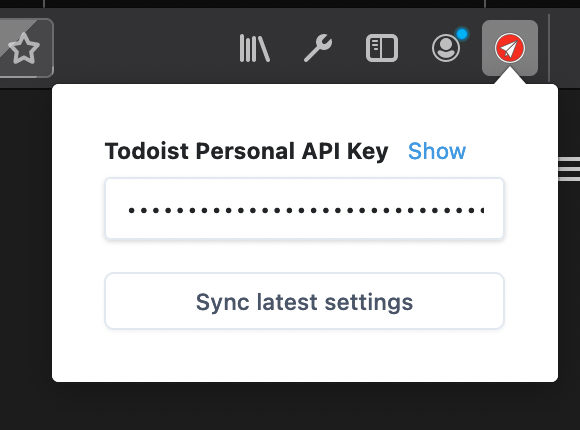

# Send To Todoist

A web extension to quickly create tasks in Todoist.

## Build

**Requirements**

Operating system capable of running Node.js (at least version 10.17.0) and should have that installed along with `npm`.

1. Clone this repository
1. Run `npm install` to install all runtime and development dependencies
1. Run `npm run build` to build JavaScript code using Webpack
1. Run `npm run watch:ext` to run extension as a temporary addon in a new instance of Firefox Developer Edition

## Screenshots

## License

[Apache-2.0](./LICENSE)
